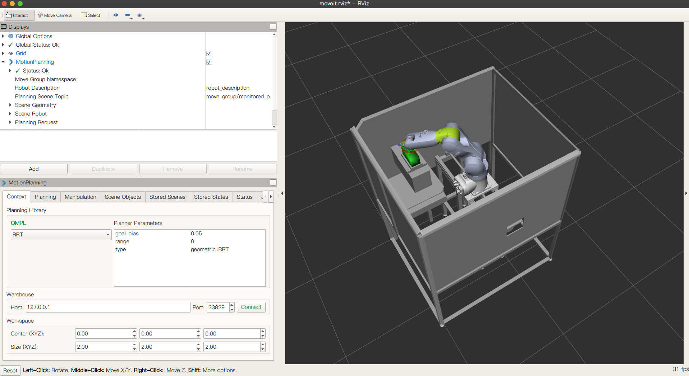
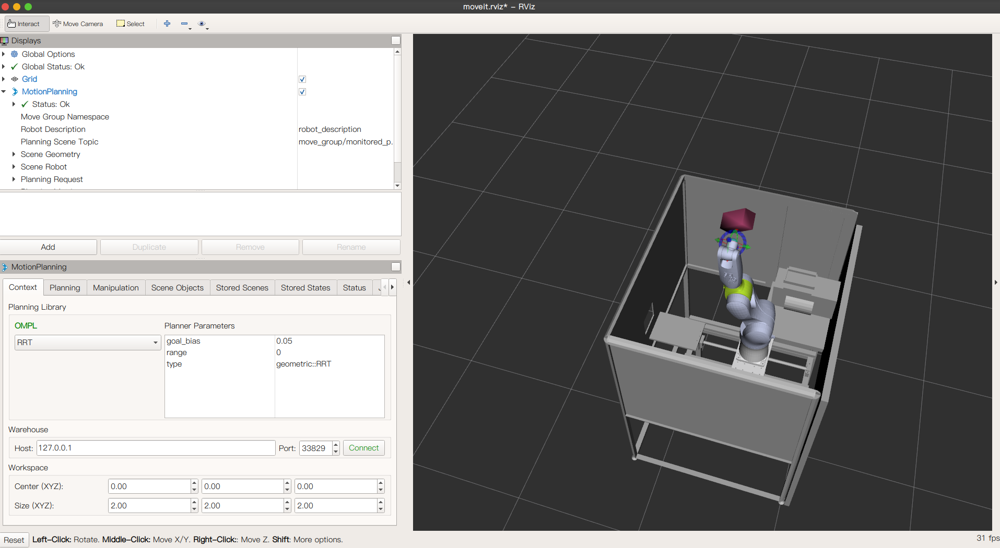
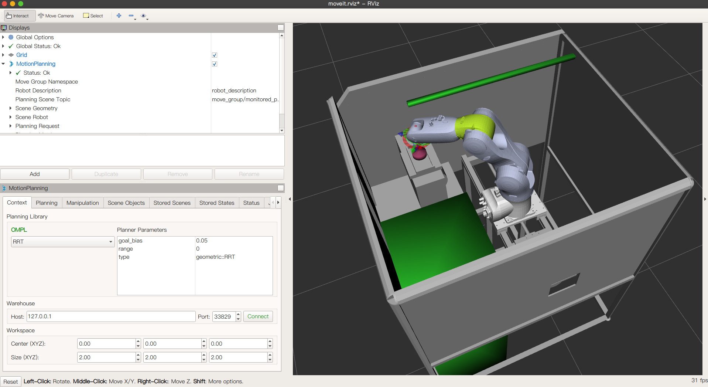
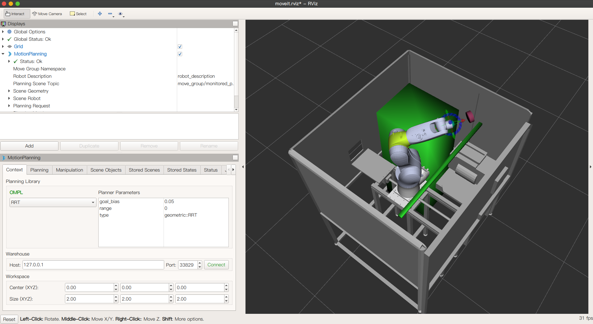
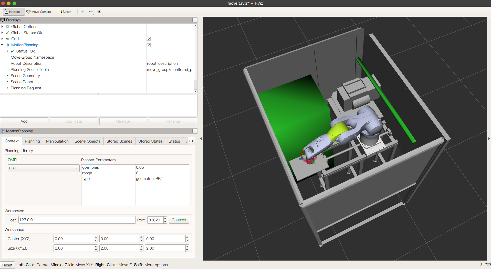

# 同济大学中德工程学院机械电子工程专业2017级项目管理课程 —— 基于数字孪生系统的自动化编程

## 一、介绍
  
本项目以数字孪生系统为模型，以真实工业机械臂及工位作为校验工具。通过虚拟系统中的路径规划与碰撞预防算法，指导工业机械臂完成工件夹取操作。本项目中使用ROS与MoveIt！进行机械臂的路径规划与碰撞预防，控制工业机械臂七轴运动。使用opcua实现虚拟机械臂与实体机械臂的通讯。项目参与学生需要具备一定的Linux知识以及C++、Python编程基础。

## 二、环境依赖

- Ubuntu 18.04
- ROS Melodic
- Moveit!
- opcua

## 三、软件架构

```Shell
.
├── Documents                 //一些文档资料
├── LICENSE                   //MIT开源协议
├── manage.md                 //Git工作流程说明文档
├── Model                     //存放机械臂模型
│   ├── Model_URDF_SLDASM     //kuka机械臂SolidWorks模型
│   └── 归档                   //模型归档
├── README.en.md
├── README.md
├── ws_kuka_v1                //ROS项目工作区（version1-机械臂模型不包含底部平动副-6轴）
|   └── src                   //机械臂路径规划包源代码
│       ├── CMakeLists.txt
|       ├── kuka_moveit       //使用MoveIt！驱动kuka机械臂包
│       ├── kuka_urdf         //定义kuka机械臂urdf包
│       └── ros_opcua_communication         //opcua通讯包
└── ws_kuka_v2                //ROS项目工作区（version2-机械臂模型不包含底部平动副-7轴）
    └── src                   //机械臂路径规划包源代码
        ├── CMakeLists.txt
        ├── kuka_moveit       //使用MoveIt！驱动kuka机械臂包
        ├── kuka_urdf         //定义kuka机械臂urdf包
        └── ros_opcua_communication         //opcua通讯包
```

## 四、使用说明

### 运行机械臂路径规划

```Shell
$ roscore
$ cd ws_kuka_v2
$ catkin_make
$ source ./devel/setup.bash                             //若使用zsh，则运行`$ source ./devel/setup.zsh`
$ roslaunch kuka_moveit demo.launch                     //运行机械臂模型的rviz仿真
$ roslaunch kuka_moveit moveKuka.launch     //运行机械臂控制程序，包括环境障碍物stl的添加、目标夹取物的添加与机械臂的路径规划和导航
```

### OPCUA通讯设置

```Shell
$ roslaunch ros_opcua_impl_python_opcua rosopcua.launch  //运行ros_opcua_communication
$ opcua-client  //运行opcua-client客户端
```

- 在终端中的通讯界面的上方地址栏输入opc.tcp://localhost:21554,点击右侧connection按钮，实现通讯
- 在ROS->Objects->ROS_Actions->move_group->move_group_send_goal下右键，选择call，可输入目标坐标，实现通讯

```Shell
$ rqu_graph   //使用`rqu_graph`图表检查通讯状况
```

## 五、结果截图








## 六、项目视频

[基于数字孪生系统与ROS的机器人路径规划与避障](https://www.bilibili.com/video/BV1N54y1q7c4/)

## 七、参与贡献

| 贡献者 |          邮箱          |
| :----: | :--------------------: |
| 邓中柱 |  dzhongzhu@icloud.com  |
| 韩煦源 | xuyuan.HAN@outlook.com |
|  杨丰  | Jessica.YANG.work@outlook.com|
| 蒋晗茜 | 1750117@tongji.edu.cn  |
| 臧浩楠 |  HAONAN.ZANG@qq.com    |
|  周行  |  1281619825@qq.com    |