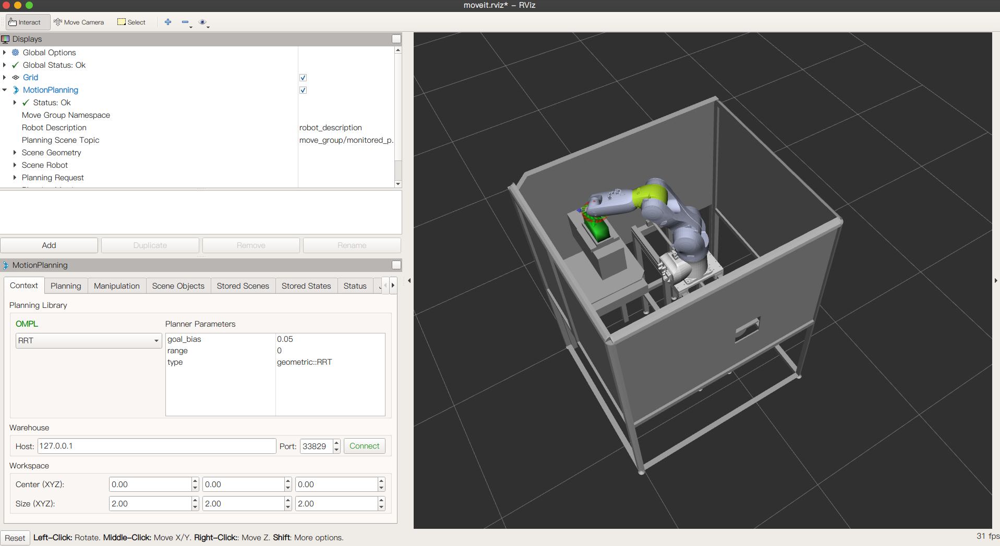
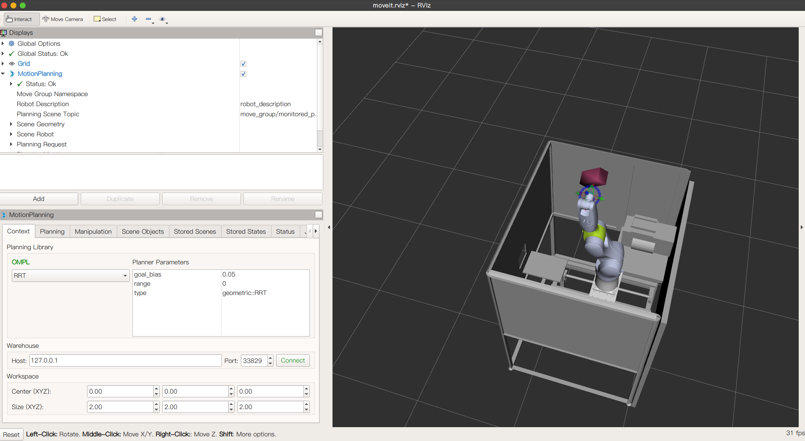
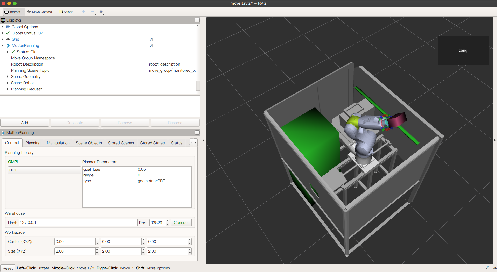
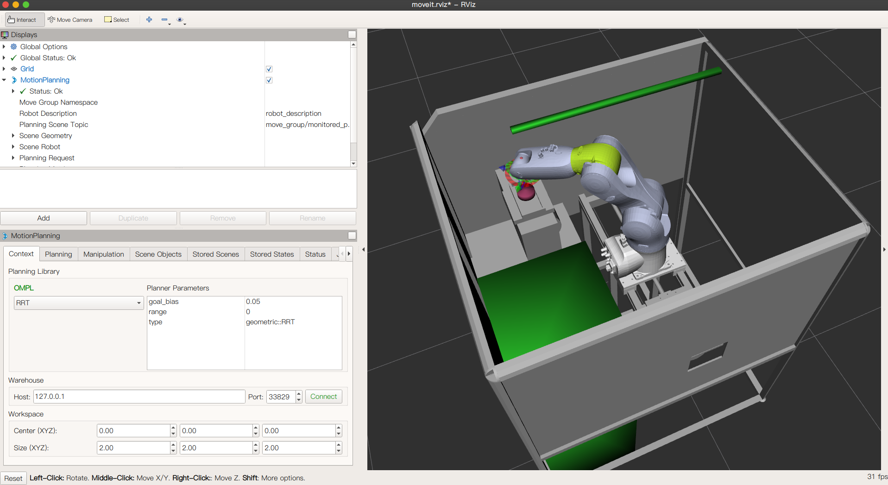
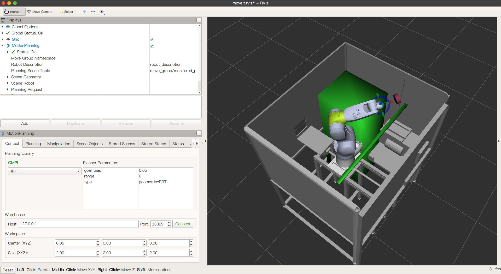
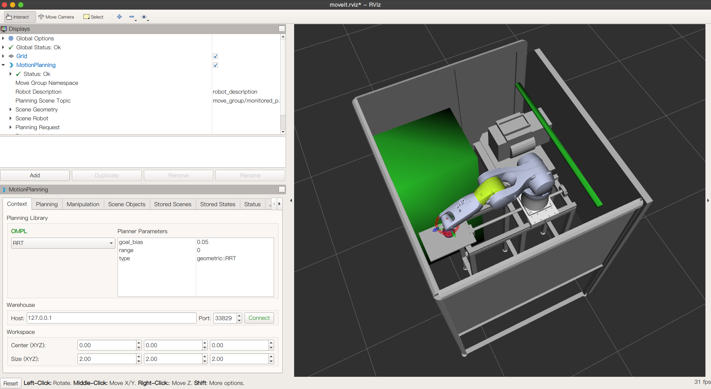

English ｜ [中文(简体)](README-zh-CN.md)

# Robot Path Planning and Obstacle Avoidance Based on Digital Twin Systems and ROS

## 1. Introduction

This project uses a digital twin system as a model, with real industrial robotic arms and workstations as verification tools. Through path planning and collision prevention algorithms in the virtual system, the industrial robotic arm is guided to complete the workpiece gripping operation. In this project, ROS and MoveIt! are used for the path planning and collision prevention of the robotic arm, controlling the seven-axis movement of the industrial robotic arm. OPCUA is used to establish communication between the virtual robotic arm and the physical robotic arm. Students participating in the project need to have some knowledge of Linux and the basics of C++ and Python programming.

## 2. Environment Dependencies

- Ubuntu 18.04
- ROS Melodic
- Moveit!
- OPCUA

## 3. Software Architecture

```Shell
.
├── Documents                 // Some documents
├── LICENSE                   // MIT open source license
├── manage.md                 // Git workflow document
├── Model                     // Arm model storage
│   ├── Model_URDF_SLDASM     // kuka robotic arm SolidWorks model
│   └── Archive               // Model Archive
├── README.en.md
├── README.md
├── ws_kuka_v1                // ROS project workspace (version1 - robotic arm model does not include bottom prismatic pair - 6-axis)
│   └── src                   // Robotic arm path planning package source code
│       ├── CMakeLists.txt
│       ├── kuka_moveit       // Using MoveIt! to drive the kuka robotic arm package
│       ├── kuka_urdf         // Define the kuka robotic arm urdf package
│       └── ros_opcua_communication    // opcua communication package
└── ws_kuka_v2                // ROS project workspace (version2 - robotic arm model does not include bottom prismatic pair - 7-axis)
    └── src                   // Robotic arm path planning package source code
        ├── CMakeLists.txt
        ├── kuka_moveit       // Using MoveIt! to drive the kuka robotic arm package
        ├── kuka_urdf         // Define the kuka robotic arm urdf package
        └── ros_opcua_communication    // opcua communication package

```

## 4. Usage

### Running Robotic Arm Path Planning

```Shell
$ roscore
$ cd ws_kuka_v2
$ catkin_make
$ source ./devel/setup.bash                             // If using zsh, run `$ source ./devel/setup.zsh`
$ roslaunch kuka_moveit demo.launch                     // Running rviz simulation of the robotic arm model
$ roslaunch kuka_moveit moveKuka.launch   // Run robotic arm control program, including adding environment obstacles stl, adding target gripping object, and robotic arm path planning and navigation
```

### OPCUA Communication Setup

```Shell
$ roslaunch ros_opcua_impl_python_opcua rosopcua.launch  // Run ros_opcua_communication
$ opcua-client  // Run opcua-client client
```

- Enter opc.tcp://localhost:21554 in the address bar of the communication interface in the terminal, click the connection button on the right to establish communication
- Right-click on ROS->Objects->ROS_Actions->move_group->move_group_send_goal in the terminal, select call, you can enter the target coordinates to achieve communication

```Shell
$ rqu_graph   // Use `rqu_graph` graph to check the communication status
```

## 5. Screenshots of the Results








## 6. Project Video (in Chinese)

[Robot Path Planning and Obstacle Avoidance Based on Digital Twin Systems and ROS](https://www.youtube.com/watch?v=7niT4ZsYazw)

## 7. Contribution

| Contributors |          Email          |
| :----: | :--------------------: |
|  Zhongzhu Deng |  dzhongzhu@icloud.com  |
|  Xuyuan Han | xuyuan.HAN@outlook.com |
|   Feng Yang | Jessica.YANG.work@outlook.com|
|  Hanxi Jiang| 1750117@tongji.edu.cn  |
|  Haonan Zang|  HAONAN.ZANG@qq.com    |
|   Xing Zhou |  1281619825@qq.com    |